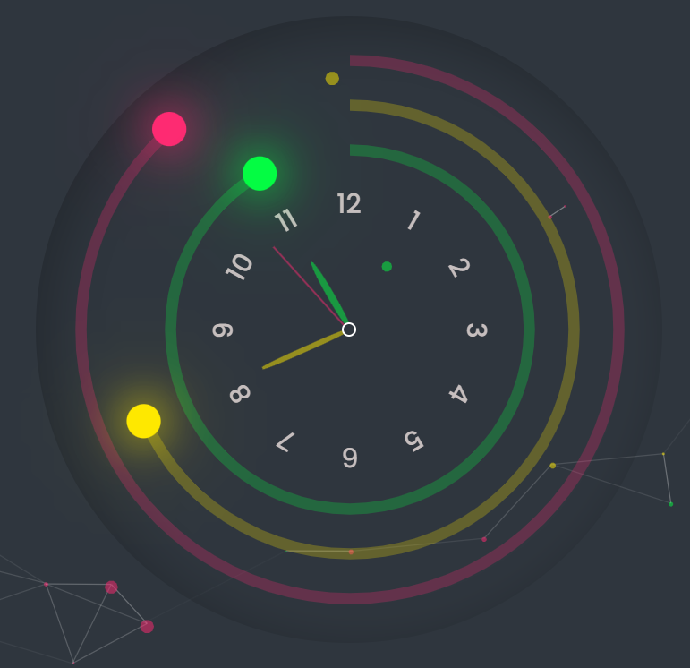

# [Analog Clock by Niladri Ghoshal](https://ng-analog-clock.netlify.app/)



This is a [simple analog clock](https://ng-analog-clock.netlify.app/) designed and developed by Niladri Ghoshal. The clock displays the current time in hours, minutes, and seconds using rotating hands and dots, giving it a classic analog clock look. It is built using HTML, CSS, and JavaScript.

## Preview
Here you can get a preview of the clock.


## Features

- Real-time display of hours, minutes, and seconds.
- Smooth animations for clock hands and dots.
- Mobile-responsive design for a seamless experience on different devices.
- Stylish and visually appealing design.

## How to Use

1. Clone the repository or download the files.


1. git clone ``` https://github.com/niladrighoshal/Analog-clock ```

2. Open the index.html file in your web browser.

3. The analog clock will be displayed with the current time.


## Customization
You can customize the clock's appearance by modifying the style.css file. Feel free to experiment with different colors, sizes, or add your own creative touch to the design.

## Compatibility
The clock is compatible with modern web browsers and has been tested on the latest versions of Chrome, Firefox, Safari, and Edge.

## Credits
Clock design and development by Niladri Ghoshal.

Idea from [Online Tutorials](https://youtu.be/FKQqFn2j0Ys)

Particle.js library used for the background particles effect.

Fonts from Google Fonts.

## Acknowledgments
Thank you for checking out this analog clock project! If you have any feedback, suggestions, or questions, please feel free to contact me.

I hope you enjoy using this analog clock!
